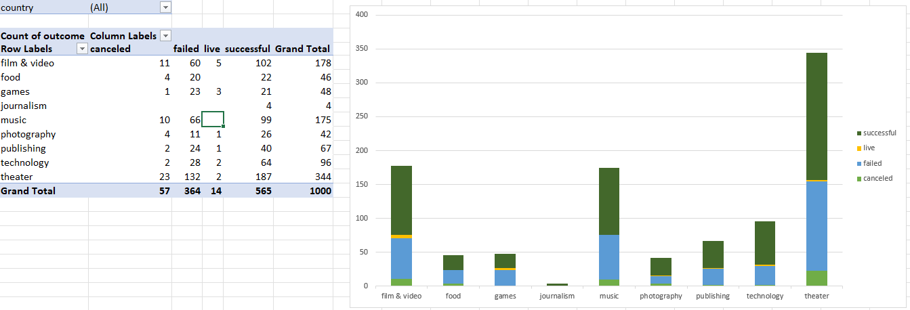
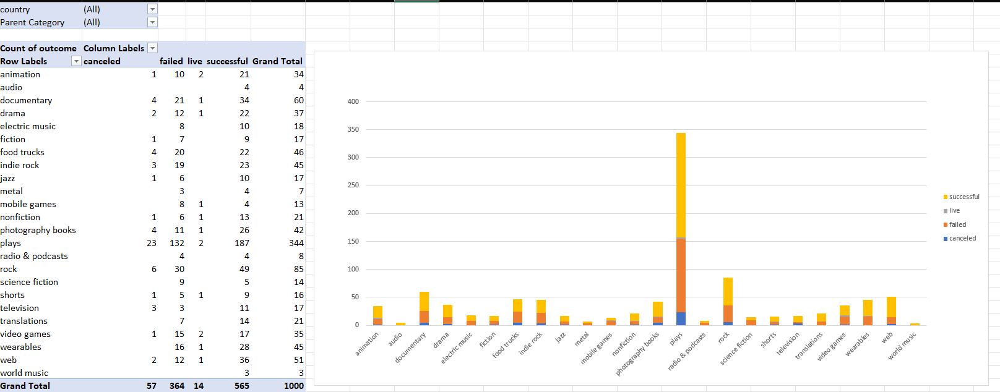
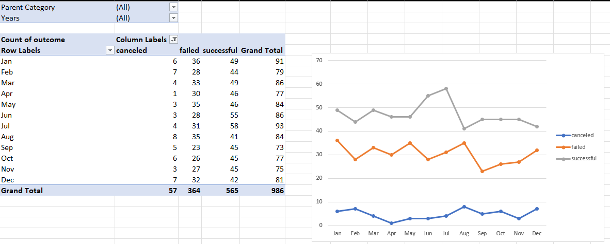
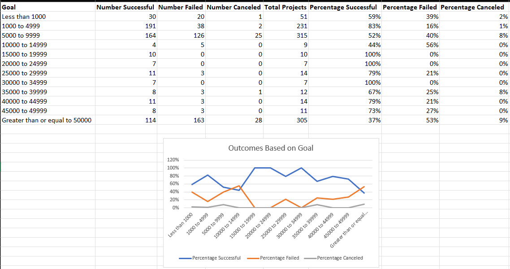
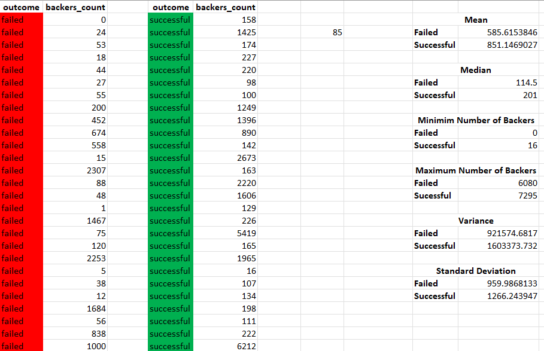

Excel Database Challenge

Background

Crowdfunding platforms like Kickstarter and Indiegogo have been growing in success and popularity since the late 2000s. From independent content creators to famous celebrities, more and more people are using crowdfunding to launch new products and generate buzz, but not every project has found success.

To receive funding, the organization must meet or exceed an initial goal, so many organizations dedicate considerable resources looking through old projects in an attempt to discover “the trick” to finding success. A database of 1,000 sample projects was provided to uncover any hidden trends. The database consisted of an excel file that contained information of each project including the ID number, name of the organization, a brief description of the organization ("blurb"), the goal of the organization's project, the amount of money pledged, the country, the category & sub-category of the project (e.g., food, music, technology, music, etc).

In this project, we were tasked with organizing the database by splitting values for easier readability and analysis and creating conditional formatting, creating pivot tables and graphs to examine which categories performed better, and calculating descriptive statistics for the successful and failed outcomes.

Database Organization

We applied conditional formatting to the 'outcome' column to easily identify which projects were successful, failed, canceled, or currently live. We added a 'percent funded' column formula that calculated much money a campaign made relative to its initial funding goal. We also applied conditional formatting to this new 'percent funded' column, and it scaled with the project earnings relative to the funding they received. After condition formatting was applied to both columns, we split the 'category & subcategory' colum into two columns: 'category' and 'subcategory' for a more percise analysis of each project. For instance, 'music/rock' in the 'category & subcategory' column would be split into 'music' for the category and 'rock' for the sub-category. Lastly, we converted the dates in the 'deadline' and 'launched_at' columns from Unix timestamps into excel date format.

Pivot Tables

We generated three pivot tables to provide a better breakdown of the data. The first pivot table showed how many campaigns were successful, failed, canceled, or are currently live per category. We added filters so the pivot table can be filtered by country. To visualize the category data, we created a stacked-column pivot chart to display the amount of campaigns were successful, failed, canceled, or are currently live in each category.

The second pivot table showed how many campaigns were successful, failed, or canceled, or are currently live per sub-category. We added filters so the pivot table can be filtered by country and primary category. To visualize the sub-category data, we designed a stacked-column pivot chart to display the amount of campaigns were successful, failed, canceled, or are currently live in these sub-categories.

We produced a final pivot table to display information on the number of campaigns that were successful, failed, canceled, or are currently live per month. We added filters so that the pivot table can be filtered based on category and year. We created a pivot-chart line graph to visualize the data.

Goal Analysis
We created a breakdown of both the amount and percentage of the successful, failed, and canceled projects per funding goal. We added a line graph to illustrate the relationship between relationship between the percent of successful projects and the funding goal.

Statistical Analysis

Given the provided data, here are three conclusions we can draw from these specific crowdfunding campaigns:
1.	The two-month span from June to July had a higher success rate for crowd funding relative the average success rate over each month throughout the year.
2.	The largest parent category within this set of data was that of theater crowdfunding, with 150 more projects for crowdfunding than film and video, the second most popular.
3.	Within subcategories of this data, film was by far and away the most popular with just shy of 350 crowdfunding projects, while no other subcategory had over 100.

However, drawing these conclusions only apply to this data set alone, and not crowdfunding in general due to the limitations of the data. This data set only has 7 countries included and leaves out a vast array of other crowdfunding projects in different areas of the world. This data set also only started occurring data starting in January of 2010, leaving anything before this time not included in the data as well. 

Finally, another table/graph that would be useful would be one that compares the goal of the crowdfunding project, the average donation as well as if it was successful of not. Looking at the data, it seems to be a trend that the extremely large goals seemed to fail more often, and the extremely small goals seem to be more successful, baring a few outliers that is. None the less, this table would provide another way to look at the data of crowdfunding.

